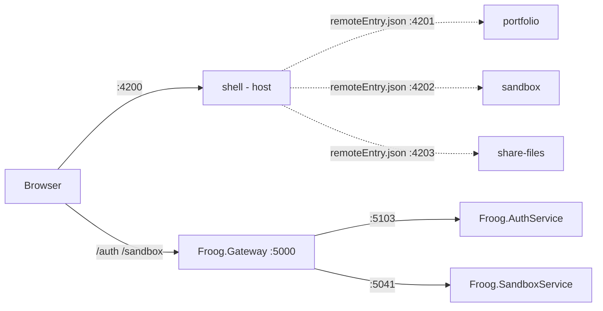
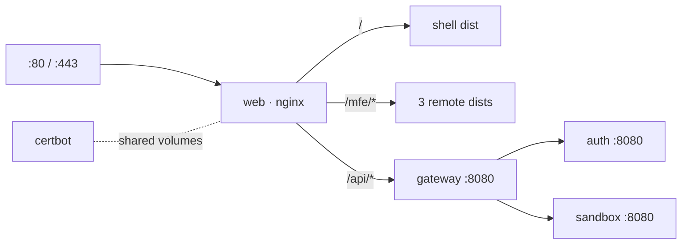

# Froog — Project Guide

A micro-frontend Angular client backed by a YARP reverse-proxy gateway and a set of
independent .NET services.

---

## 1. Architecture at a glance



Two independent halves that share one idea: **separately built pieces, assembled at
runtime behind a single entry point.** The shell is that entry point for the UI, the
gateway is that entry point for the APIs.

### Port map

| Piece | HTTP | HTTPS | Role |
| --- | --- | --- | --- |
| `Froog.Gateway` | 5000 | 7120 | Reverse proxy, single API origin |
| `Froog.AuthService` | 5103 | 7155 | Auth API (placeholder) |
| `Froog.SandboxService` | 5041 | 7223 | Sandbox API (placeholder) |
| `shell` | 4200 | — | Native Federation **dynamic host** |
| `portfolio` | 4201 | — | Remote |
| `sandbox` | 4202 | — | Remote |
| `share-files` | 4203 | — | Remote |

---

## 2. Backend

### 2.1 Solution layout

`backend/Froog.slnx` (the new XML solution format) contains three ASP.NET Core projects
targeting **.NET 10**. `backend/NuGet.config` clears inherited feeds and pins nuget.org
as the only source.

### 2.2 The Gateway

`Froog.Gateway` is a **reverse proxy**, not an application. It owns no business logic —
`Program.cs` is about 25 lines and the only endpoint it implements itself is `/health`.
Everything else is forwarded.

```csharp
builder.Services
    .AddReverseProxy()
    .LoadFromConfig(builder.Configuration.GetSection("ReverseProxy"));
```

That reads the `ReverseProxy` section of `appsettings.json`, which has two halves.

**Routes — the matching rules.**

```json
"auth": {
  "ClusterId": "auth-cluster",
  "Match": { "Path": "/auth/{**catch-all}" },
  "Transforms": [ { "PathRemovePrefix": "/auth" } ]
}
```

`{**catch-all}` is a greedy wildcard: it matches `/auth/` plus everything after it.

**Clusters — the destinations.**

```json
"auth-cluster": {
  "Destinations": { "auth": { "Address": "http://localhost:5103/" } }
}
```

A cluster may hold several destinations — that is where load balancing would live. Each
route names a `ClusterId`, and that pairing is the entire routing table.

**Transforms are the part that is easy to miss.** Without them a request to `/auth/login`
is forwarded verbatim as `/auth/login`. But `AuthService` has no idea it lives behind a
gateway — it maps `/`, not `/auth/`. So it would return 404. `PathRemovePrefix: /auth`
strips the routing segment before forwarding, so `/auth/login` arrives as `/login`. The
prefix exists purely to tell the *gateway* where to send the request.

You can watch this happen in the gateway log:

```text
Proxying to http://localhost:5103/ HTTP/2 RequestVersionOrLower
Received HTTP/1.1 response 200.
```

`HTTP/2 RequestVersionOrLower` means YARP prefers HTTP/2 upstream but downgrades when the
destination does not support it.

**Why have a gateway at all?**

- One origin for the browser. The client only knows `localhost:5000`; it never learns that
  auth is on 5103 and sandbox on 5041.
- Services can be moved, split, or scaled without touching client code.
- CORS is configured once, not per service.
- It is the natural home for cross-cutting concerns: token validation, rate limiting,
  request logging.

**CORS** lives here for that reason. `localhost:4200 → localhost:5000` is cross-origin
(a different port is a different origin), so the gateway must return
`Access-Control-Allow-Origin`. `UseCors` is registered *before* `MapReverseProxy()` so the
middleware also runs on proxied requests, including the browser's preflight `OPTIONS`.

### 2.3 The services

`Froog.AuthService` and `Froog.SandboxService` are placeholder minimal APIs
(`app.MapGet("/", () => "Hello World!")`). They are plain ASP.NET Core apps with no
awareness of the gateway — which is the point. They stay independently runnable and
testable. Their ports come from `applicationUrl` in `Properties/launchSettings.json`,
which `dotnet run` reads in development.

### 2.4 Startup order matters

The gateway holds no connection to the services until a request arrives, then dials them
on demand. If a service is not listening, that dial fails immediately:

```text
System.Net.Http.HttpRequestException: No connection could be made because the
target machine actively refused it. (localhost:5103)
```

The gateway itself starts fine — it just has nothing to talk to. **Start the services
first, the gateway last.**

---

## 3. Frontend

### 3.1 What Native Federation is doing

Instead of one Angular application, there are four, **built and deployed separately but
assembled in the browser at runtime**.

`shell` is the **dynamic host** — the only app a user navigates to. It does not hardcode
remote URLs; it reads them from `projects/shell/src/assets/federation.manifest.json`:

```json
{
  "portfolio": "http://localhost:4201/remoteEntry.json",
  "sandbox": "http://localhost:4202/remoteEntry.json",
  "shareFiles": "http://localhost:4203/remoteEntry.json"
}
```

The other three are **remotes**. Each declares in its `federation.config.js`:

```js
name: 'portfolio',
exposes: { './Routes': './projects/portfolio/src/app/app.routes.ts' }
```

That `exposes` block is what makes the build emit **`remoteEntry.json`** — a manifest
describing what the app publishes and which shared libraries it carries. Without
`exposes`, no entry file is produced at all and every remote fetch 404s.

Unlike Module Federation, none of this is webpack-specific. Native Federation builds with
esbuild and wires everything together with a standard **import map**, shimmed by
`es-module-shims` for browsers that do not support them natively.

### 3.2 How one route loads

In `projects/shell/src/app/app.routes.ts`:

```ts
{
  path: '',
  loadChildren: () =>
    loadRemoteModule('portfolio', './Routes').then(m => m.routes)
}
```

`'portfolio'` is the key from the manifest, not a URL. On navigation the browser resolves
it through the import map, fetches the exposed `./Routes` chunk from the *portfolio* dev
server, and hands the resulting `Routes` array to the Angular router as child routes. None
of that code is in the shell's bundle.

Current route table:

| Path | Remote name | Port |
| --- | --- | --- |
| `sandbox` | `sandbox` | 4202 |
| `files` | `shareFiles` | 4203 |
| `''` | `portfolio` | 4201 |

`''` is matched last on purpose — with prefix matching it would otherwise swallow every
other path.

### 3.3 The supporting machinery

**`shareAll` is the negotiation layer.** Both shell and portfolio bundle Angular. Without
coordination the browser loads two copies, and Angular breaks badly with duplicate copies
of its DI system.

```js
shared: { ...shareAll({ singleton: true, strictVersion: true, requiredVersion: 'auto' }) }
```

`singleton` enforces one shared instance; `strictVersion` throws loudly on a version
mismatch instead of misbehaving silently.

**`shareAll` reads `dependencies`, so build-only tooling must not live there.** Tailwind
and PostCSS are Node packages; sharing them makes the build fail with `Could not resolve
"fs"`. They belong in `devDependencies` (or in the config's `skip` list).

**`initFederation` and `bootstrap.ts`.** Every app's `main.ts` calls `initFederation()`
and only then dynamically imports `./bootstrap`. That indirection is mandatory — the
import map must be installed *before* any Angular code executes. A static import would
evaluate Angular immediately and lose the race. The host passes the manifest path;
remotes call it with no arguments.

**The builder chain.** `angular.json` gives every project four targets:
`build` and `serve` run `@angular-architects/native-federation:build`, which wraps the
real `esbuild` (`@angular-devkit/build-angular:application`) and `serve-original`
(`dev-server`) targets. Output lands in `dist/<project>/browser`.

`es-module-shims` is listed alongside `zone.js` in each project's `polyfills` array.

### 3.4 Version constraints (important)

The following must move together — they are locked to the same major:

| Package | Version | Constraint |
| --- | --- | --- |
| `@angular/*` | 17.3 | baseline; 17.1+ required by Native Federation 17.1 |
| `@angular-architects/native-federation` | 17.1.8 | must match Angular major |
| `es-module-shims` | 1.5+ | import-map polyfill, injected as a polyfill entry |
| `tailwindcss` | 3.4 | Angular 17's builder only accepts Tailwind 2 or 3 |

Tailwind 4 requires Angular 20+ (it needs PostCSS config file support, added in v20).
Upgrading Tailwind means upgrading Angular across all four projects.

---

## 4. Running it

### Backend — three terminals, in this order

```powershell
dotnet run --project h:\Projects\froog\backend\Froog.AuthService     # 5103
dotnet run --project h:\Projects\froog\backend\Froog.SandboxService  # 5041
dotnet run --project h:\Projects\froog\backend\Froog.Gateway         # 5000
```

Use the absolute project path, or run `dotnet run --project backend\Froog.AuthService`
from the repository root.

### Frontend — one command

```powershell
cd client
npm run run:all
```

That runs `concurrently`, which starts all four dev servers with colour-coded prefixed
output. Then open <http://localhost:4200>.

### Smoke tests

```powershell
curl.exe http://localhost:5000/health      # Gateway OK
curl.exe http://localhost:5000/auth/       # Hello World!  (via AuthService)
curl.exe http://localhost:5000/sandbox/    # Hello World!  (via SandboxService)
```

Federation is working when the shell page contains text from a remote — the DOM should
show both `Hello, shell` and `Hello, portfolio`.

---

## 5. Deployment

One domain, one VPS, five containers. `web` is nginx: it terminates TLS, serves all four
Angular apps, and proxies `/api` to the gateway. Nothing else publishes a port.



### 5.1 Path layout

| URL | Serves |
| --- | --- |
| `/` | shell `dist`, with SPA fallback to `index.html` |
| `/mfe/portfolio/` | portfolio `dist` |
| `/mfe/sandbox/` | sandbox `dist` |
| `/mfe/share-files/` | share-files `dist` |
| `/api/*` | gateway, with `/api` stripped |

Remote *assets* live under `/mfe/` so they cannot collide with the shell's *routes*
(`/sandbox`, `/files`). Each remote is built with a matching `baseHref`; the shell keeps
`/` because Native Federation resolves the host's own `remoteEntry.json` and shared
bundles against the document base href.

Because everything is one origin, `projects/shell/federation.manifest.prod.json` uses
root-absolute URLs — no hostname is baked into any image, so the same `froog-web` image
runs in any environment. The client Dockerfile copies it over the development manifest.

### 5.2 Images

Four images, all built by `.github/workflows/docker-publish.yml` on push to `main` and
published to GHCR. The VPS only pulls.

| Image | Context | Dockerfile |
| --- | --- | --- |
| `froog-web` | `client/` | `client/Dockerfile` |
| `froog-gateway` | `backend/` | `backend/Froog.Gateway/Dockerfile` |
| `froog-auth` | `backend/` | `backend/Froog.AuthService/Dockerfile` |
| `froog-sandbox` | `backend/` | `backend/Froog.SandboxService/Dockerfile` |

The backend build context is `backend/`, not the individual project folder, because
`NuGet.config` sits at the backend root and restore needs it.

`docker-compose.yml` overrides the gateway's cluster addresses with environment
variables rather than editing `appsettings.json`, so the `localhost:5103` / `localhost:5041`
values keep working for local development.

### 5.3 First deploy

Prerequisites: `duttyfroog.com` and `www.duttyfroog.com` A records pointing at the VPS,
ports 80 and 443 open.

```bash
cp .env.example .env && $EDITOR .env
docker compose pull
docker compose up -d
```

nginx boots on a throwaway self-signed certificate — it will not start without a
certificate file, and certbot cannot pass its HTTP-01 challenge until nginx is serving.
That placeholder occupies the path certbot wants, so clear it before requesting the real
one:

```bash
docker compose run --rm --entrypoint sh certbot -c \
  'rm -rf /etc/letsencrypt/live/duttyfroog.com \
          /etc/letsencrypt/archive/duttyfroog.com \
          /etc/letsencrypt/renewal/duttyfroog.com.conf'

docker compose run --rm certbot certonly --webroot -w /var/www/certbot \
  -d duttyfroog.com -d www.duttyfroog.com \
  --email you@duttyfroog.com --agree-tos --no-eff-email

docker compose exec web nginx -s reload
```

### 5.4 Redeploy and renewal

```bash
docker compose pull && docker compose up -d
```

The `certbot` container renews on a 12-hour loop, but nginx only picks up a rotated
certificate on reload. Add a weekly cron entry:

```
0 4 * * 1 cd /srv/froog && docker compose exec -T web nginx -s reload
```

### 5.5 Smoke tests

```bash
curl https://duttyfroog.com/api/health                          # Gateway OK
curl https://duttyfroog.com/api/auth/                           # Hello World!
curl https://duttyfroog.com/api/sandbox/                        # Hello World!
curl -I https://duttyfroog.com/mfe/portfolio/remoteEntry.json   # 200, Cache-Control: no-cache
curl -o /dev/null -w '%{http_code}\n' https://duttyfroog.com/mfe/nope.js   # 404, not HTML
docker compose ps                                               # only `web` lists ports
```

That last `/mfe/` check matters: if a missing chunk fell through to the SPA and returned
`index.html`, the browser would report an opaque module parse error instead of a 404.

### 5.6 Testing the images locally

`docker-compose.dev.yml` builds from source instead of pulling and binds unprivileged
ports, so you can exercise the packaged app before anything reaches CI:

```powershell
docker compose -f docker-compose.yml -f docker-compose.dev.yml --env-file .env.example up --build
```

Browse **https://localhost:8443** — note the scheme. `DOMAIN=localhost` makes the
entrypoint mint a self-signed certificate, so the browser warns once.

This is the only place the production wiring is exercised: the `/mfe/*` manifest, the
`baseHref` values, and the nginx routing are all bypassed by `ng serve`. It is not a
development loop, though — there is no hot reload, and every change means rebuilding all
four Angular apps. Use section 4 for feature work.

When something misbehaves, the two files worth inspecting inside the container:

```powershell
docker compose -f docker-compose.yml -f docker-compose.dev.yml exec web sh
# cat /etc/nginx/conf.d/default.conf   -> confirms ${DOMAIN} was substituted
# ls /usr/share/nginx/html/mfe/portfolio/ -> confirms the COPY paths landed
```

---

## 6. Request flow, end to end

1. Browser loads `localhost:4200` → shell `main.ts` → `initFederation('/assets/federation.manifest.json')` installs the import map → `bootstrap.ts` → Angular starts.
2. Router hits `''` → `loadRemoteModule('portfolio', './Routes')` resolves through the import
   map and fetches portfolio's exposed chunk.
3. Shared scope resolves; portfolio's routes and components render inside the shell's
   `<router-outlet>`.
4. A component calls `localhost:5000/auth/whatever`.
5. Gateway matches the `auth` route, strips `/auth`, forwards to
   `localhost:5103/whatever`.
6. AuthService responds; the gateway relays it back with CORS headers attached.

---

## 7. Troubleshooting

| Symptom | Cause | Fix |
| --- | --- | --- |
| `HttpRequestException: target machine actively refused it` | Downstream service not running | Start the service before the gateway |
| Gateway returns 404 from a service | Missing `PathRemovePrefix` transform | Add the transform to the route |
| `Failed to bind to address ... already in use` | Two projects share an `applicationUrl` | Give each a unique port |
| CORS error in browser console | Request bypasses the gateway, or `UseCors` is registered after `MapReverseProxy` | Call through 5000; keep `UseCors` first |
| Remote route fails, `remoteEntry.json` 404 | Remote has no `exposes` block, so no entry file is emitted | Add `name` + `exposes` to its `federation.config.js` |
| Build fails with `Could not resolve "fs"` while preparing shared packages | A Node-only package (Tailwind, PostCSS) sits in `dependencies`, so `shareAll` tries to bundle it for the browser | Move it to `devDependencies`, or add it to `skip` in `federation.config.js` |
| `EBUSY ... node_modules/.cache/native-federation/*.js` on first `run:all` | All four dev servers race to populate the shared cache on a cold start | Re-run `npm run run:all`; the cache is written once and reused |
| `ERESOLVE` on `npm install` | Angular / Native Federation / Tailwind majors disagree | Align them to the same major |
| `strictVersion` runtime error | Two apps loaded different versions of a shared library | Keep dependency versions identical across projects |
| `ERR_REQUIRE_ESM` from `mf-dev-server.js` | The v17 dev server requires CommonJS chalk; chalk 5 is ESM | Not applicable since the move to Native Federation |
| `NG0912: Component ID generation collision` | Every app scaffolds `AppComponent` with selector `app-root` | Harmless; resolves once remotes expose real feature components |
| `'concurrently' is not recognized` | npm ran outside `client/`, so local `.bin` is not on PATH | `cd client` first — `--prefix` does not change the working directory |

---

## 8. Known gaps / next steps

- Auth and Sandbox services are placeholders returning `"Hello World!"`.
- Remote apps route to their scaffolded `AppComponent`; replace with real features.
- Nothing in the client calls the API yet. When that lands, base the calls on `/api` —
  same origin, no CORS, no environment-specific host. At that point the unconditional
  `WithOrigins("http://localhost:4200", ...)` block in `Froog.Gateway/Program.cs` should
  become development-only.
- Deployment is manual (`docker compose pull && up -d`). Automating it from CI needs an
  SSH deploy key stored as a repository secret.
- No authentication is enforced at the gateway yet — that is the natural place for JWT
  validation.
- `npm audit` reports vulnerabilities inherent to the Angular 17 toolchain; clearing them
  means upgrading Angular.
- There is no single command to start the backend. A PowerShell script that starts the two
  services, waits for their ports, then runs the gateway in the foreground would cover it.
