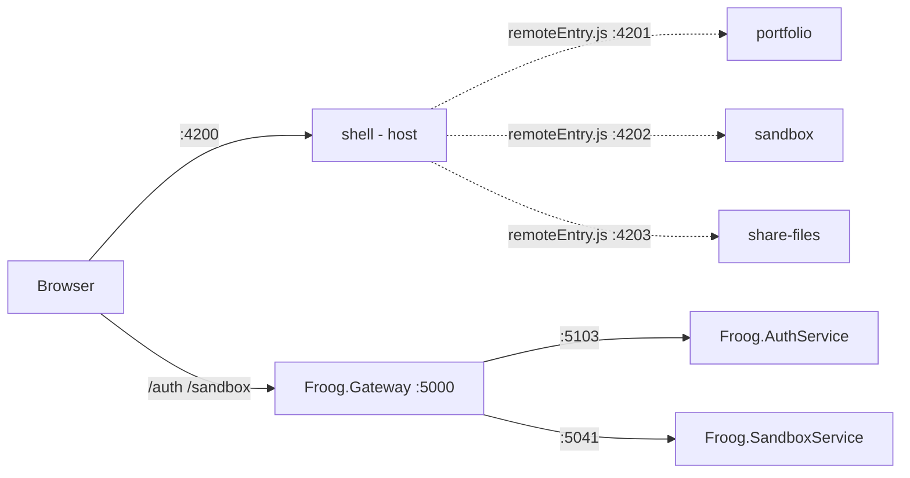

# Froog — Project Guide

A micro-frontend Angular client backed by a YARP reverse-proxy gateway and a set of
independent .NET services.

---

## 1. Architecture at a glance



Two independent halves that share one idea: **separately built pieces, assembled at
runtime behind a single entry point.** The shell is that entry point for the UI, the
gateway is that entry point for the APIs.

### Port map

| Piece | HTTP | HTTPS | Role |
| --- | --- | --- | --- |
| `Froog.Gateway` | 5000 | 7120 | Reverse proxy, single API origin |
| `Froog.AuthService` | 5103 | 7155 | Auth API (placeholder) |
| `Froog.SandboxService` | 5041 | 7223 | Sandbox API (placeholder) |
| `shell` | 4200 | — | Module Federation **host** |
| `portfolio` | 4201 | — | Remote |
| `sandbox` | 4202 | — | Remote |
| `share-files` | 4203 | — | Remote |

---

## 2. Backend

### 2.1 Solution layout

`backend/Froog.slnx` (the new XML solution format) contains three ASP.NET Core projects
targeting **.NET 10**. `backend/NuGet.config` clears inherited feeds and pins nuget.org
as the only source.

### 2.2 The Gateway

`Froog.Gateway` is a **reverse proxy**, not an application. It owns no business logic —
`Program.cs` is about 25 lines and the only endpoint it implements itself is `/health`.
Everything else is forwarded.

```csharp
builder.Services
    .AddReverseProxy()
    .LoadFromConfig(builder.Configuration.GetSection("ReverseProxy"));
```

That reads the `ReverseProxy` section of `appsettings.json`, which has two halves.

**Routes — the matching rules.**

```json
"auth": {
  "ClusterId": "auth-cluster",
  "Match": { "Path": "/auth/{**catch-all}" },
  "Transforms": [ { "PathRemovePrefix": "/auth" } ]
}
```

`{**catch-all}` is a greedy wildcard: it matches `/auth/` plus everything after it.

**Clusters — the destinations.**

```json
"auth-cluster": {
  "Destinations": { "auth": { "Address": "http://localhost:5103/" } }
}
```

A cluster may hold several destinations — that is where load balancing would live. Each
route names a `ClusterId`, and that pairing is the entire routing table.

**Transforms are the part that is easy to miss.** Without them a request to `/auth/login`
is forwarded verbatim as `/auth/login`. But `AuthService` has no idea it lives behind a
gateway — it maps `/`, not `/auth/`. So it would return 404. `PathRemovePrefix: /auth`
strips the routing segment before forwarding, so `/auth/login` arrives as `/login`. The
prefix exists purely to tell the *gateway* where to send the request.

You can watch this happen in the gateway log:

```text
Proxying to http://localhost:5103/ HTTP/2 RequestVersionOrLower
Received HTTP/1.1 response 200.
```

`HTTP/2 RequestVersionOrLower` means YARP prefers HTTP/2 upstream but downgrades when the
destination does not support it.

**Why have a gateway at all?**

- One origin for the browser. The client only knows `localhost:5000`; it never learns that
  auth is on 5103 and sandbox on 5041.
- Services can be moved, split, or scaled without touching client code.
- CORS is configured once, not per service.
- It is the natural home for cross-cutting concerns: token validation, rate limiting,
  request logging.

**CORS** lives here for that reason. `localhost:4200 → localhost:5000` is cross-origin
(a different port is a different origin), so the gateway must return
`Access-Control-Allow-Origin`. `UseCors` is registered *before* `MapReverseProxy()` so the
middleware also runs on proxied requests, including the browser's preflight `OPTIONS`.

### 2.3 The services

`Froog.AuthService` and `Froog.SandboxService` are placeholder minimal APIs
(`app.MapGet("/", () => "Hello World!")`). They are plain ASP.NET Core apps with no
awareness of the gateway — which is the point. They stay independently runnable and
testable. Their ports come from `applicationUrl` in `Properties/launchSettings.json`,
which `dotnet run` reads in development.

### 2.4 Startup order matters

The gateway holds no connection to the services until a request arrives, then dials them
on demand. If a service is not listening, that dial fails immediately:

```text
System.Net.Http.HttpRequestException: No connection could be made because the
target machine actively refused it. (localhost:5103)
```

The gateway itself starts fine — it just has nothing to talk to. **Start the services
first, the gateway last.**

---

## 3. Frontend

### 3.1 What Module Federation is doing

Instead of one Angular application, there are four, **built and deployed separately but
assembled in the browser at runtime**.

`shell` is the **host** — the only app a user navigates to. Its `webpack.config.js` lists
`remotes`, the URLs of apps it can pull code from.

The other three are **remotes**. Each declares:

```js
name: 'portfolio',
exposes: { './Routes': './projects/portfolio/src/app/app.routes.ts' }
```

That `exposes` block is what makes webpack emit **`remoteEntry.js`** — a small manifest
describing what the app publishes and which shared libraries it carries. Without
`exposes`, no `remoteEntry.js` is produced at all and every remote fetch 404s.

### 3.2 How one route loads

In `projects/shell/src/app/app.routes.ts`:

```ts
{
  path: '',
  loadChildren: () =>
    loadRemoteModule({
      type: 'module',
      remoteEntry: 'http://localhost:4201/remoteEntry.js',
      exposedModule: './Routes'
    }).then(m => m.routes)
}
```

On navigation the browser fetches `remoteEntry.js` from the *portfolio* dev server,
negotiates shared dependencies, dynamically imports the exposed `./Routes`, and hands the
resulting `Routes` array to the Angular router as child routes. None of that code is in
the shell's bundle.

Current route table:

| Path | Remote | Port |
| --- | --- | --- |
| `''` | portfolio | 4201 |
| `sandbox` | sandbox | 4202 |
| `files` | shareFiles | 4203 |

### 3.3 The supporting machinery

**`shareAll` is the negotiation layer.** Both shell and portfolio bundle Angular. Without
coordination the browser loads two copies, and Angular breaks badly with duplicate copies
of its DI system.

```js
shared: { ...shareAll({ singleton: true, strictVersion: true, requiredVersion: 'auto' }) }
```

`singleton` enforces one shared instance; `strictVersion` throws loudly on a version
mismatch instead of misbehaving silently.

**`bootstrap.ts` and the dynamic import.** Every app's `main.ts` is just
`import('./bootstrap')`. That indirection is mandatory — shared-scope negotiation must
finish *before* any Angular code executes. A static import would evaluate Angular
immediately and lose the race.

**`ngx-build-plus`** is the glue that lets Angular's builder accept an
`extraWebpackConfig`. The stock CLI does not expose webpack config, which is why
`angular.json` uses `ngx-build-plus:browser` instead of the default builder.

**`commonChunk: false`** stops webpack from splitting shared code into a common chunk,
which would conflict with federation's own sharing mechanism.

### 3.4 Version constraints (important)

The following must move together — they are locked to the same major:

| Package | Version | Constraint |
| --- | --- | --- |
| `@angular/*` | 17.3 | baseline |
| `@angular-architects/module-federation` | 17.0.8 | must match Angular major |
| `ngx-build-plus` | 17.0.0 | needs `@angular-devkit/build-angular` of the same major |
| `tailwindcss` | 3.4 | Angular 17's builder only accepts Tailwind 2 or 3 |

Tailwind 4 requires Angular 20+ (it needs PostCSS config file support, added in v20).
Upgrading Tailwind means upgrading Angular across all four projects.

---

## 4. Running it

### Backend — three terminals, in this order

```powershell
dotnet run --project h:\Projects\froog\backend\Froog.AuthService     # 5103
dotnet run --project h:\Projects\froog\backend\Froog.SandboxService  # 5041
dotnet run --project h:\Projects\froog\backend\Froog.Gateway         # 5000
```

Use the absolute project path, or run `dotnet run --project backend\Froog.AuthService`
from the repository root.

### Frontend — one command

```powershell
cd client
npm run run:all
```

That runs `concurrently`, which starts all four dev servers with colour-coded prefixed
output. Then open <http://localhost:4200>.

### Smoke tests

```powershell
curl.exe http://localhost:5000/health      # Gateway OK
curl.exe http://localhost:5000/auth/       # Hello World!  (via AuthService)
curl.exe http://localhost:5000/sandbox/    # Hello World!  (via SandboxService)
```

Federation is working when the shell page contains text from a remote — the DOM should
show both `Hello, shell` and `Hello, portfolio`.

---

## 5. Request flow, end to end

1. Browser loads `localhost:4200` → shell `main.ts` → `bootstrap.ts` → Angular starts.
2. Router hits `''` → `loadRemoteModule` fetches `localhost:4201/remoteEntry.js`.
3. Shared scope resolves; portfolio's routes and components render inside the shell's
   `<router-outlet>`.
4. A component calls `localhost:5000/auth/whatever`.
5. Gateway matches the `auth` route, strips `/auth`, forwards to
   `localhost:5103/whatever`.
6. AuthService responds; the gateway relays it back with CORS headers attached.

---

## 6. Troubleshooting

| Symptom | Cause | Fix |
| --- | --- | --- |
| `HttpRequestException: target machine actively refused it` | Downstream service not running | Start the service before the gateway |
| Gateway returns 404 from a service | Missing `PathRemovePrefix` transform | Add the transform to the route |
| `Failed to bind to address ... already in use` | Two projects share an `applicationUrl` | Give each a unique port |
| CORS error in browser console | Request bypasses the gateway, or `UseCors` is registered after `MapReverseProxy` | Call through 5000; keep `UseCors` first |
| Remote route fails, `remoteEntry.js` 404 | Remote has no `exposes` block, so no entry file is emitted | Add `name` + `exposes` to its webpack config |
| `ERESOLVE` on `npm install` | Angular / MF / ngx-build-plus / Tailwind majors disagree | Align all four to the same major |
| `strictVersion` runtime error | Two apps loaded different versions of a shared library | Keep dependency versions identical across projects |
| `ERR_REQUIRE_ESM` from `mf-dev-server.js` | The v17 dev server requires CommonJS chalk; chalk 5 is ESM | Use the `concurrently`-based `run:all` script |
| `NG0912: Component ID generation collision` | Every app scaffolds `AppComponent` with selector `app-root` | Harmless; resolves once remotes expose real feature components |
| `'concurrently' is not recognized` | npm ran outside `client/`, so local `.bin` is not on PATH | `cd client` first — `--prefix` does not change the working directory |

---

## 7. Known gaps / next steps

- Auth and Sandbox services are placeholders returning `"Hello World!"`.
- Remote apps route to their scaffolded `AppComponent`; replace with real features.
- Remote URLs are hardcoded to `localhost` in `app.routes.ts`. For multiple environments,
  switch to a Module Federation **manifest** (`mf.manifest.json` + `initFederation`) so
  URLs are configuration rather than code.
- No authentication is enforced at the gateway yet — that is the natural place for JWT
  validation.
- `npm audit` reports vulnerabilities inherent to the Angular 17 toolchain; clearing them
  means upgrading Angular.
- There is no single command to start the backend. A PowerShell script that starts the two
  services, waits for their ports, then runs the gateway in the foreground would cover it.
